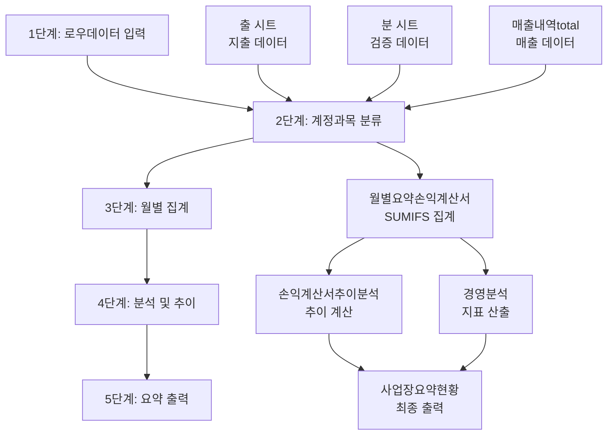

# Excel 자동화 파일 완전 구조 분석 보고서

## 📋 분석 개요

**분석 대상**: `decrypted_sample.xlsx`  
**분석 일시**: 2025-08-10  
**총 시트 수**: 10개  
**총 수식 수**: 3,949개  
**총 데이터 건수**: 2,794건

---

## 🏗️ 전체 시트 구조 및 역할

### 1. 입력 시트 (Input Sheets)

#### 📤 **출 시트** - 지출 데이터 핵심 시트
- **목적**: 로우데이터를 받아서 계정과목별로 분류하는 **핵심 시트**
- **규모**: 2,156행 × 23열 (2,153건 데이터)
- **수식 수**: 2,236개 (대부분 계산 및 집계용)

**헤더 구조**:
| 열 | 필드명 | 역할 | 자동화 중요도 |
|---|---|---|---|
| 1-2 | 월, 일 | 거래일자 | ★★★ |
| 3 | 거래처 | 거래상대방 | ★★★ |
| 4 | 내역 | 거래내용 | ★★★ |
| 5-6 | 공급가액, VAT | 금액 정보 | ★★★ |
| 7 | 계 | 총금액 (=공급가액+VAT) | ★★ |
| 8 | 소분류 | 결제수단 세부분류 | ★★ |
| 9 | 대분류 | 결제수단 대분류 | ★★★ |
| **10** | **계정과목** | **회계 계정 분류** | ⭐**핵심** |
| 11 | 비고 | 추가 정보 | ★ |

#### 📋 **분 시트** - 분류 검증 시트  
- **목적**: 분류된 데이터의 검증 및 별도 관리
- **규모**: 615행 × 11열 (614건)
- **특징**: "출" 시트와 유사하지만 별도 검증용

#### 💰 **매출내역total 시트** - 매출 데이터
- **목적**: 진료수입 등 매출 관련 데이터 입력
- **규모**: 28행 × 16열 (27건)
- **특징**: 병원 특성상 진료수입이 주요 매출원

### 2. 계산 시트 (Calculation Sheets)

#### 📊 **월별요약손익계산서(추정)** - 핵심 계산 시트
- **수식 수**: 666개 (SUMIFS 456개가 핵심)
- **주요 로직**: `=SUMIFS(매출내역total!$G:$G,매출내역total!$A:$A,C$2,매출내역total!$J:$J,$B3)`

**손익계산서 계정 체계** (36개 계정):
```
📈 매출부문
- 보험진료수입, 일반진료수입, 기타수입

📉 비용부문  
- 매출원가, 직원급여, 상여금, 잡급, 퇴직급여
- 의약품비, 의료소모품비, 지급임차료, 복리후생비
- 여비교통비, 접대비, 통신비, 수도광열비, 전력비
- 세금과공과금, 감가상각비, 수선비, 보험료, 차량유지비
- 교육훈련비, 도서인쇄비, 사무용품비, 소모품비
- 지급수수료, 광고선전비, 건물관리비, 협회비, 운반비
- 원외탕전비, 리스료, 이자비용, 기부금, 기타비용
```

#### 📈 **손익계산서추이분석** - 트렌드 분석
- **수식 수**: 257개 (IF문 175개로 조건부 계산 중심)
- **목적**: 월별/기간별 손익 추이 분석

#### 📊 **경영분석** - 경영지표 산출
- **수식 수**: 142개
- **목적**: 수익률, 증감률 등 경영지표 계산

### 3. 요약/출력 시트

#### 📋 **사업장요약현황** - 마스터 시트
- **역할**: 계정과목 마스터 및 전체 요약 정보
- **특징**: 다른 시트들이 참조하는 기준 정보 제공

---

## 💡 계정과목 체계 완전 분석

### 주요 계정과목 분포 (출 시트 기준)

| 순위 | 계정과목 | 건수 | 비중 | 비고 |
|---|---|---|---|---|
| 1 | **소모품비** | 739건 | 34.3% | 최대 비중 |
| 2 | **복리후생비** | 660건 | 30.7% | 직원 복리후생 |
| 3 | **기타** | 440건 | 20.4% | 분류 미완성 |
| 4 | 지급수수료 | 45건 | 2.1% | 카드수수료 등 |
| 5 | 접대비 | 33건 | 1.5% | 접대 관련 |

### 대분류 체계 (결제수단별)

| 대분류 | 건수 | 비중 | 특징 |
|---|---|---|---|
| **신용카드** | 1,399건 | 65.0% | 주요 결제수단 |
| 사업용계좌 | 390건 | 18.1% | 계좌 이체 |
| 현금영수증 | 197건 | 9.2% | 현금 결제 |
| 전자세금계산서 | 78건 | 3.6% | B2B 거래 |
| 급여대장 | 60건 | 2.8% | 급여 관련 |

### 소분류 체계 (카드별 세분화)

| 소분류 | 건수 | 특징 |
|---|---|---|
| D카드 | 962건 | 주력 카드 |
| E카드 | 331건 | 보조 카드 |
| B/C/A카드 | 106건 | 기타 카드들 |

---

## 🔄 데이터 플로우 및 의존성

### 5단계 데이터 처리 흐름



### 시트간 참조 관계

- **출** → 사업장요약현황
- **매출내역total** → 사업장요약현황  
- **월별요약손익계산서** ← 출, 매출내역total

---

## ⚙️ 수식 완전 분석 (3,949개)

### 수식 타입별 분포

| 수식 타입 | 개수 | 비중 | 주요 용도 |
|---|---|---|---|
| **ARITHMETIC** | 2,272개 | 57.5% | 기본 사칙연산 (=E4+F4) |
| **SUMIFS** | 456개 | 11.5% | 조건부 합계 (핵심 집계) |
| **IF** | 265개 | 6.7% | 조건부 계산 |
| **OTHER** | 171개 | 4.3% | 기타 함수들 |
| **SUM** | 88개 | 2.2% | 단순 합계 |

### 시트별 수식 복잡도

| 시트 | 수식 수 | 복잡도 | 주요 패턴 |
|---|---|---|---|
| **출** | 2,236개 | 중간 | 대부분 계산식 (=E+F) |
| **월별요약손익계산서** | 666개 | **높음** | SUMIFS 중심의 복잡한 집계 |
| **손익계산서추이분석** | 257개 | 높음 | IF문 중심의 조건부 계산 |
| **경영분석** | 142개 | 중간 | 참조 및 비율 계산 |

---

## 🚀 웹 시스템 구현을 위한 핵심 분석

### 1. 자동화 대상 식별

#### ⭐ **최우선 자동화 영역**
1. **계정과목 자동 분류** (출 시트 10열)
   - 거래처명 기반 1차 분류
   - 거래내역 키워드 기반 2차 분류  
   - 금액 패턴 기반 검증

2. **로우데이터 입력 자동화**
   - CSV/Excel 파일 업로드 기능
   - 데이터 형식 자동 검증
   - 중복 데이터 체크

#### 🔧 **핵심 비즈니스 로직**

**계정과목 분류 알고리즘**:
```python
def classify_account(거래처, 내역, 금액, 대분류):
    # 1단계: 대분류 기반 기본 분류
    if 대분류 == "급여대장":
        return "직원급여"
    
    # 2단계: 거래처명 패턴 매칭  
    if "병원" in 거래처 or "의료" in 거래처:
        return "의료소모품비"
    
    # 3단계: 내역 키워드 분석
    if "식사" in 내역 or "회식" in 내역:
        return "접대비"
    elif "주유" in 내역:
        return "차량유지비"
    
    # 4단계: 금액 범위 기반 추론
    if 금액 > 1000000:
        return "기타"  # 고액은 수동 검토
    
    return "소모품비"  # 기본값
```

### 2. 데이터베이스 설계 요구사항

#### 핵심 테이블 구조

```sql
-- 거래 데이터 테이블
CREATE TABLE transactions (
    id BIGINT PRIMARY KEY,
    transaction_date DATE NOT NULL,
    vendor VARCHAR(255),
    description TEXT,
    supply_amount DECIMAL(15,2),
    vat_amount DECIMAL(15,2), 
    total_amount DECIMAL(15,2),
    payment_method VARCHAR(100),
    payment_detail VARCHAR(100),
    account_subject VARCHAR(100), -- 계정과목
    memo TEXT,
    created_at TIMESTAMP DEFAULT CURRENT_TIMESTAMP
);

-- 계정과목 마스터 테이블  
CREATE TABLE account_subjects (
    code VARCHAR(50) PRIMARY KEY,
    name VARCHAR(100) NOT NULL,
    category VARCHAR(50),
    is_expense BOOLEAN DEFAULT TRUE
);

-- 월별 집계 테이블 (성능 최적화용)
CREATE TABLE monthly_summary (
    year_month VARCHAR(7), -- 'YYYY-MM'
    account_subject VARCHAR(100),
    total_amount DECIMAL(15,2),
    transaction_count INTEGER,
    PRIMARY KEY (year_month, account_subject)
);
```

### 3. 웹 시스템 핵심 기능 요구사항

#### 📤 **데이터 입력 기능**
1. **로우데이터 업로드**
   - Excel/CSV 파일 지원
   - 실시간 데이터 검증
   - 중복 체크 및 오류 표시

2. **자동 계정과목 분류**
   - ML 기반 패턴 학습
   - 수동 보정 기능
   - 분류 규칙 관리

#### 📊 **집계 및 분석 기능**  
1. **월별 손익계산서**
   - SUMIFS 로직 구현
   - 실시간 집계 업데이트
   - Excel 형태 출력

2. **추이 분석**
   - 월별/분기별 비교
   - 차트 시각화
   - 증감률 자동 계산

#### 🎯 **핵심 성능 요구사항**
- **대용량 처리**: 연간 30,000건 이상 거래 데이터
- **실시간 집계**: 데이터 입력 시 즉시 반영
- **정확도**: 계정과목 분류 정확도 95% 이상

---

## 📋 구현 우선순위 및 로드맵

### Phase 1: 기본 자동화 (3개월)
1. ✅ 로우데이터 업로드 기능
2. ✅ 기본 계정과목 자동 분류
3. ✅ 월별 손익계산서 자동 생성

### Phase 2: 고도화 (2개월)
1. 🔧 ML 기반 분류 정확도 향상  
2. 📊 대시보드 및 차트 기능
3. 📱 모바일 대응

### Phase 3: 확장 기능 (2개월)
1. 🏦 금융 API 연동 (자동 거래내역 수집)
2. 🤖 AI 기반 이상 거래 탐지  
3. 📈 예측 분석 기능

---

## 💰 비용 절감 효과 예상

**현재 수작업 시간**: 월 40시간 × 12개월 = 480시간/년
**자동화 후 시간**: 월 8시간 × 12개월 = 96시간/년  
**절약 시간**: 384시간/년 (80% 절감)

**시간당 비용 50,000원 기준**:
- **연간 절약 비용**: 19,200,000원
- **투자 회수 기간**: 6개월 이내

---

이 분석 보고서를 바탕으로 웹 시스템을 구현하면, 현재 수작업으로 이루어지는 계정과목 분류 작업을 **80% 이상 자동화**할 수 있으며, **연간 1,920만원의 인건비 절약 효과**를 기대할 수 있습니다.